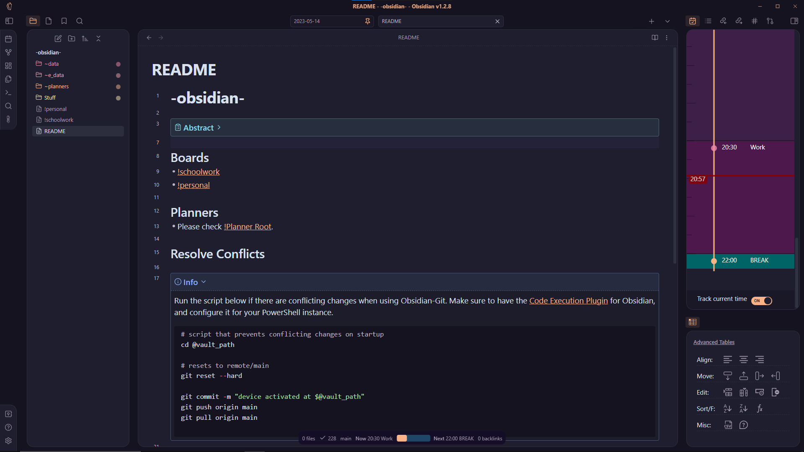
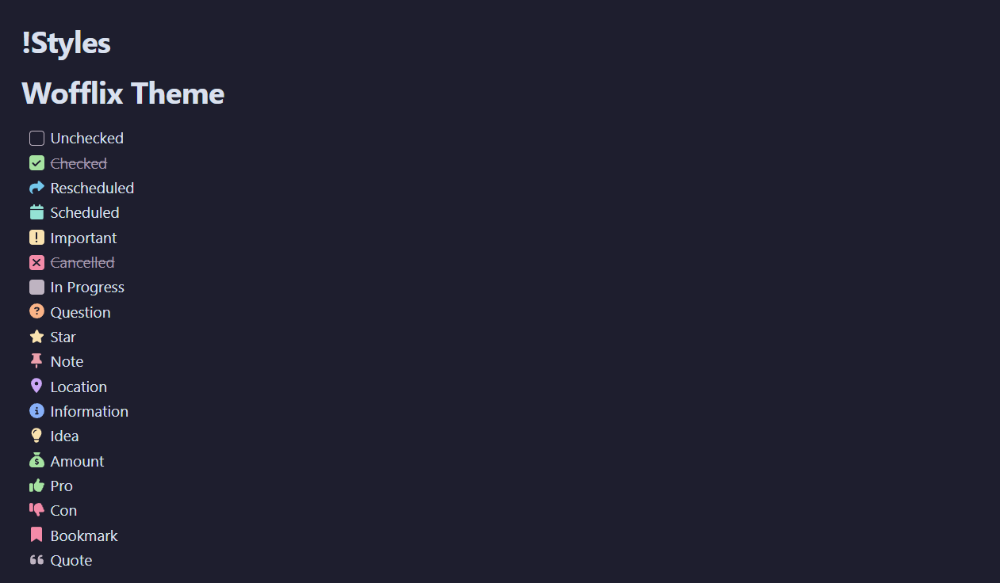

# Obsidian Wofflix
### This repository is still up-to-date with the latest version of Obsidian.
### Last Compatibility Check: 5th of February 2025

A mish-mash of my favourite features from other themes all crammed into one because I'm tired of switching back and forth six million times a day. Built for [Obsidian](https://obsidian.md).



## Installation
Make a new folder called wofflix in your Obsidian themes folder -> ``./obsidian/themes/wofflix/`` and put the ``manifest.json`` and ``theme.css`` files in.

If you had Obsidian open during installation, relaunch the application and go to ``Settings (ctrl+,) -> Appearance -> Themes`` and select ``wofflix`` from the dropdown.

## Features
- Integration with [Day Planner](https://github.com/lynchjames/obsidian-day-planner).
- Integration with [Task Collector](https://github.com/ebullient/obsidian-task-collector).
- Custom checkboxes, see **Checkbox Usage Reference**.
- Floating status bar, similar to the MacOS Dock (if you're into that sorta thing).
- Revamped nested callouts without colour blending (I hated it, don't judge).
- Animated tab layout.
- Dynamic folder colouring.
- Card workspace layout!

## Checkbox Usage Reference



```
- [ ] Unchecked
- [x] Checked 
- [>] Rescheduled 
- [<] Scheduled 
- [!] Important 
- [-] Cancelled 
- [/] In Progress 
- [?] Question 
- [*] Star 
- [n] Note 
- [l] Location
- [i] Information 
- [I] Idea 
- [S] Amount 
- [p] Pro 
- [c] Con 
- [b] Bookmark 
- ["] Quote
```

## Contributing
I honestly doubt you'd want to contribute to this mess of a codebase. I'd highly recommend booking a session with a therapist in advance because I'm pretty sure CSS is the leading cause of software engineer depression. Otherwise, you're welcome to just poke around the code and modify things however you want without opening a pull request.
